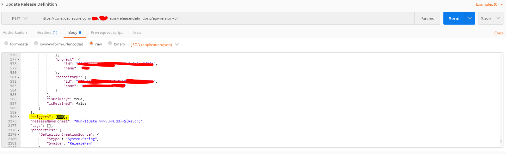

# azure-devops-schedulegenerator
Generates Azure Pipelines schedule trigger from cron pattern
Cron format parser uses https://github.com/harrisiirak/cron-parser

```
*    *    *    *    *    *
┬    ┬    ┬    ┬    ┬    ┬
│    │    │    │    │    |
│    │    │    │    │    └ day of week (0 - 7) (0 or 7 is Sun)
│    │    │    │    └───── month (1 - 12)
│    │    │    └────────── day of month (1 - 31)
│    │    └─────────────── hour (0 - 23)
│    └──────────────────── minute (0 - 59)
└───────────────────────── second (0 - 59, optional)
```

Month, day of month and second are not supported due to Azure Devops limitations.


# Usage

```
node index.js "* * */2 * * 1-3"  // will create schedule to run pipeline every 2 hour Monday, Tuesday and Wednesday
```

```
node index.js "* */5 * * * *"  //  run pipeline every five minutes every day
```

```
node index.js "* */5 * * * *" ./schedule.json  //  change output file name
```

# How to update pipeline with new schedule

* Export pipeline (json);
* Replace *triggers* part of pipeline json with one, generated by script

* Update pipeline definition using api https://docs.microsoft.com/en-us/rest/api/azure/devops/release/definitions/update